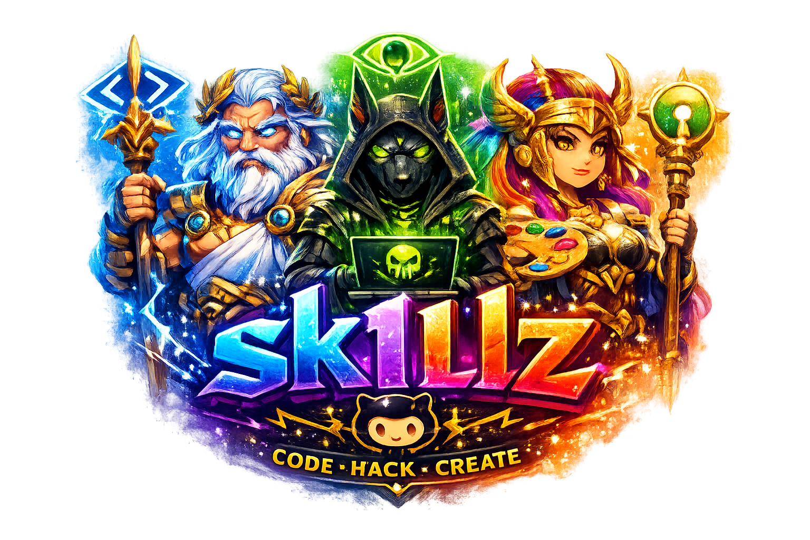

<p align="center">
  
</p>

# $K1LLZ

**Decades of wisdom. Instant transfer.**

> *What took legends a lifetime to learn, your AI can now reason with.*

---

## The Problem

Knowledge has always been locked in heads.

A senior engineer at Jane Street spent 15 years developing intuitions about low-latency systems. Leslie Lamport spent decades formalizing distributed consensus. Niko Matsakis knows things about Rust's borrow checker that exist nowhere but in the codebase and his brain.

**This knowledge was transferable only through:**
- Reading 5 books over 2 years
- Watching 50 conference talks
- Working alongside masters for a decade
- Failing expensively, then learning why

**Until now.**

---

## What This Is

This repository captures the **decision-making heuristics, mental models, and design intuitions** of legendary engineers—encoded in a format AI agents can reason with.

Not syntax. Not snippets. **How they think.**

| Dimension | Examples |
|-----------|----------|
| **Languages** | C++, Rust, Go, Python, JavaScript, Zig, and more |
| **Paradigms** | Distributed Systems, Functional, Systems Programming |
| **Domains** | Databases, Security, Networking, Testing, API Design |
| **Organizations** | Google, Netflix, Jane Street, Cloudflare, and others |

> **Live count:** See [`skills.json`](skills.json) for the current index.

---

## Who's Inside

Skills are organized across multiple axes:

- **Languages** — Masters of C++, Rust, Go, Python, JavaScript, and more
- **Paradigms** — Distributed systems, functional programming, systems programming
- **Domains** — Databases, security, networking, testing, API design
- **Organizations** — Engineering cultures from elite firms

### Featured Engineers (examples)

| Category | Engineers |
|----------|----------|
| **Language Creators** | Stroustrup (C++), Pike/Thompson (Go), Eich (JavaScript) |
| **Systems Thinkers** | Lamport (Paxos), Dean (Google), Vogels (AWS) |
| **Domain Experts** | Stonebraker (databases), Jacobson (networking), Hughes (testing) |

> Browse [`languages/`](languages/), [`paradigms/`](paradigms/), [`domains/`](domains/), and [`organizations/`](organizations/) for the full collection.

---

## What's In a Skill

Each skill encodes:

```
engineer-name/
├── SKILL.md          # Core: philosophy, principles, patterns
├── philosophy.md     # Mental models, how they approach problems
├── references.md     # Books, papers, talks
```

**Example — Lamport's distributed systems skill includes:**
- Logical clocks implementation
- Vector clock patterns
- TLA+ specification templates
- Paxos simplified
- "Safety before liveness" mental model
- His actual debugging questions

**Example — Matsakis's Rust skill includes:**
- Lifetime elision rules (know when NOT to annotate)
- Borrow splitting patterns
- Self-referential struct solutions
- "The borrow checker as design guide"
- When to use `RefCell` (and when you're doing it wrong)

---

## Usage

### With Claude/Windsurf/Cursor
```bash
# Clone to your skills directory
git clone https://github.com/copyleftdev/sk1llz ~/.claude/skills/sk1llz

# Or for project-specific
git clone https://github.com/copyleftdev/sk1llz .claude/skills/sk1llz
```

### Programmatic Access
```bash
# skills.json is the source of truth for all skills
curl -s https://raw.githubusercontent.com/copyleftdev/sk1llz/master/skills.json | jq '.skill_count'
curl -s https://raw.githubusercontent.com/copyleftdev/sk1llz/master/skills.json | jq '.skills[].id'
```

### Direct Invocation
```
"Use the lamport-distributed-systems skill when designing this consensus protocol."
"Apply stroustrup-cpp-style to review this code."
"Think like matsakis-ownership-mastery for this lifetime issue."
```

---

## Why This Matters

Knowledge has always been mimetic. Every "original" thinker absorbed from predecessors:
- Stroustrup ← Simula + C
- Lamport ← Dijkstra + state machines
- Matsakis ← Haskell type theory + systems programming

**The difference now:** We can make the transmission explicit. Instead of 10 years of osmosis, encode the distilled mental models directly.

Some call this knowledge theft. But is learning from Meyers' books theft? Is watching Lamport's lectures theft? 

**This is the same knowledge, made systematically transferable.**

---

## Structure

```
sk1llz/
├── languages/          # By programming language
│   ├── cpp/            # C++ masters
│   ├── rust/           # Rust experts
│   ├── go/             # Go creators and practitioners
│   └── ...             # Python, JavaScript, Zig, etc.
├── paradigms/          # By programming paradigm
│   ├── distributed/    # Consensus, replication, time
│   ├── functional/     # FP theory and practice
│   └── systems/        # Low-level systems programming
├── domains/            # By problem domain
│   ├── databases/      # Storage, query, transactions
│   ├── security/       # Threat hunting, detection, defense
│   ├── testing/        # TDD, property-based, simulation
│   └── ...             # Networking, API design, trading
├── organizations/      # By engineering culture
│   ├── google/         # SRE, large-scale patterns
│   ├── netflix/        # Chaos engineering, resilience
│   └── ...             # Jane Street, Cloudflare, etc.
└── skills.json         # Machine-readable index (source of truth)
```

---

## Contributing

See [CONTRIBUTING.md](CONTRIBUTING.md) for guidelines on adding new skills.

**High-value targets:**
- Compiler writers (Lattner, Nystrom)
- Graphics (Carmack, Abrash)
- Kernel developers (Torvalds, Love)
- Security researchers (Schneier, Ptacek)

---

## License

Apache 2.0 — See LICENSE

---

<p align="center">
  <i>"The skills of the gods, encoded for mortals."</i>
</p>
